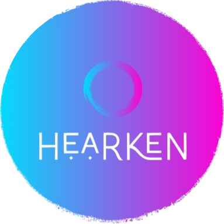
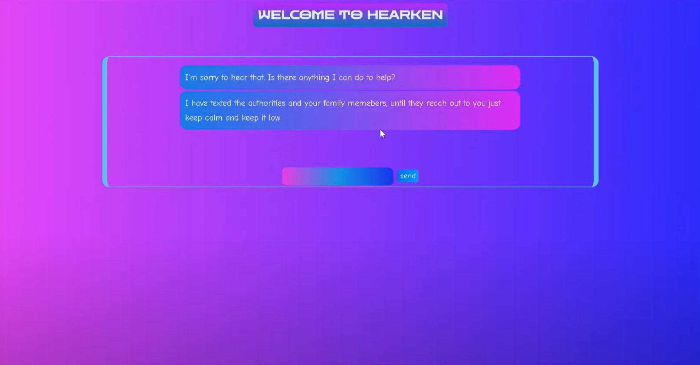
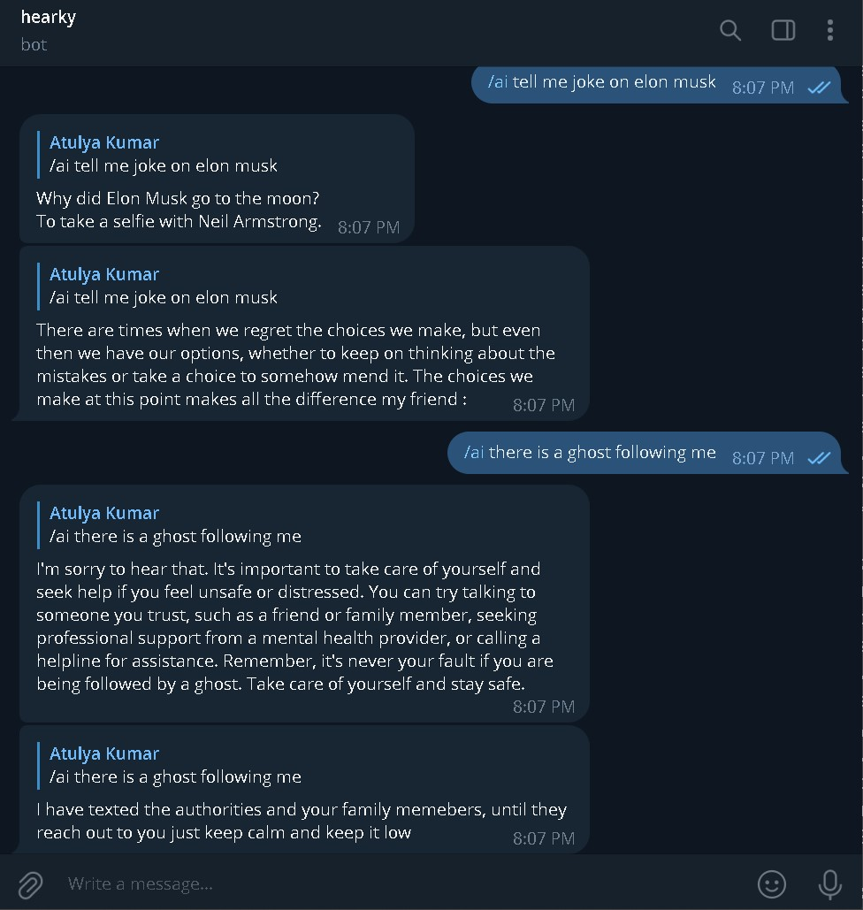

# SBSPS-Challenge-10609-LISTNER---AI-based-Life-Assistance-Chatbot-Integration-for-public-welfare
LISTNER - AI-based Life Assistance Chatbot Integration for public welfare
# Hearken Chatbot
 <!-- Add an image/logo of your chatbot here -->

Hearken is an advanced chatbot designed to provide personalized responses and take appropriate actions based on the user's emotions. Whether you're using it as a Telegram bot or for SMS alerts, Hearken is here to enhance your communication experience.

## Demo
[Watch the Demo](https://youtu.be/g6LWvyU6xjc)


## About the Project

Hearken is a versatile chatbot designed to provide seamless assistance to users. Whether you prefer to interact with it through a web interface or Telegram bot, Hearken is here to enhance your communication experience.

### Key Features

- **Emotion Detection**: Hearken utilizes advanced natural language processing to detect and understand human emotions in real-time conversations.
  

- **Action-Oriented**: Not just a chatbot, Hearken takes necessary actions based on detected emotions, ensuring user safety and well-being.

- **Telegram Integration**: Interact with Hearken seamlessly on Telegram, making it accessible wherever you are.
  

- **SMS Alerts**: In critical situations, Hearken can send SMS alerts to local authorities, ensuring swift and appropriate responses.


**Hearken** is your intelligent assistant, ready to respond to your needs and emotions, making interactions more meaningful and responsive.


## Deployment

You can deploy Hearken on IBM Cloud to make it accessible online. Follow these steps to deploy your chatbot:

### Prerequisites

1. **GitHub Repository**: Ensure you have a GitHub repository containing your Hearken chatbot project.

2. **IBM Cloud Account**: Sign up for an IBM Cloud account if you don't have one. You can sign up at [IBM Cloud](https://cloud.ibm.com/).

3. **IBM Cloud CLI**: Install the IBM Cloud Command Line Interface (CLI) on your local machine. You can download it from [here](https://cloud.ibm.com/docs/cli/reference/ibmcloud/download_cli.html).

### Deployment Steps

1. **IBM Cloud Setup**:

   - Log in to your IBM Cloud account using the IBM Cloud CLI:

     ```bash
     ibmcloud login
     ```

2. **Prepare the Project**:

   - Ensure your project is set up correctly for deployment. Update any configuration files, environment variables, or dependencies as needed.

3. **Deploy to IBM Cloud**:

   - Use the IBM Cloud CLI to deploy your project. Navigate to your project directory and run:

     ```bash
     ibmcloud cf push your-hearken-app-name
     ```

     Replace `your-hearken-app-name` with a unique name for your IBM Cloud app.

4. **Open the App**:

   - After successful deployment, open your app in the browser:

     ```bash
     ibmcloud app show your-hearken-app-name
     ```

5. **Test and Monitor**:

   - Test your chatbot on the live IBM Cloud deployment to ensure it works as expected.

6. **Share the Live App**:

   - Share the URL of your live chatbot with others. Users can now interact with Hearken from anywhere.


Your Hearken chatbot is now deployed and accessible online through IBM Cloud.

## NOTE
There are many free websites where u can deploy your flask app:
1. **Heroku** - [Heroku](https://www.heroku.com/)
2. **PythonAnywhere** - [PythonAnywhere](https://www.pythonanywhere.com/)
3. **Glitch** - [Glitch](https://glitch.com/)
4. **Vercel** - [Vercel](https://vercel.com/)
5. **Netlify** - [Netlify](https://www.netlify.com/)
6. **Google Cloud Run** - [Google Cloud Run](https://cloud.google.com/run)
7. **Microsoft Azure (Azure Functions)** - [Microsoft Azure](https://azure.microsoft.com/)
8. **AWS Lambda** - [AWS Lambda](https://aws.amazon.com/lambda/)
9. **GitHub Pages** - [GitHub Pages](https://pages.github.com/)
10. **Repl.it** - [Repl.it](https://replit.com/)


